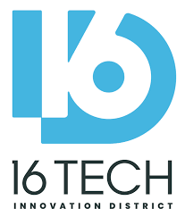
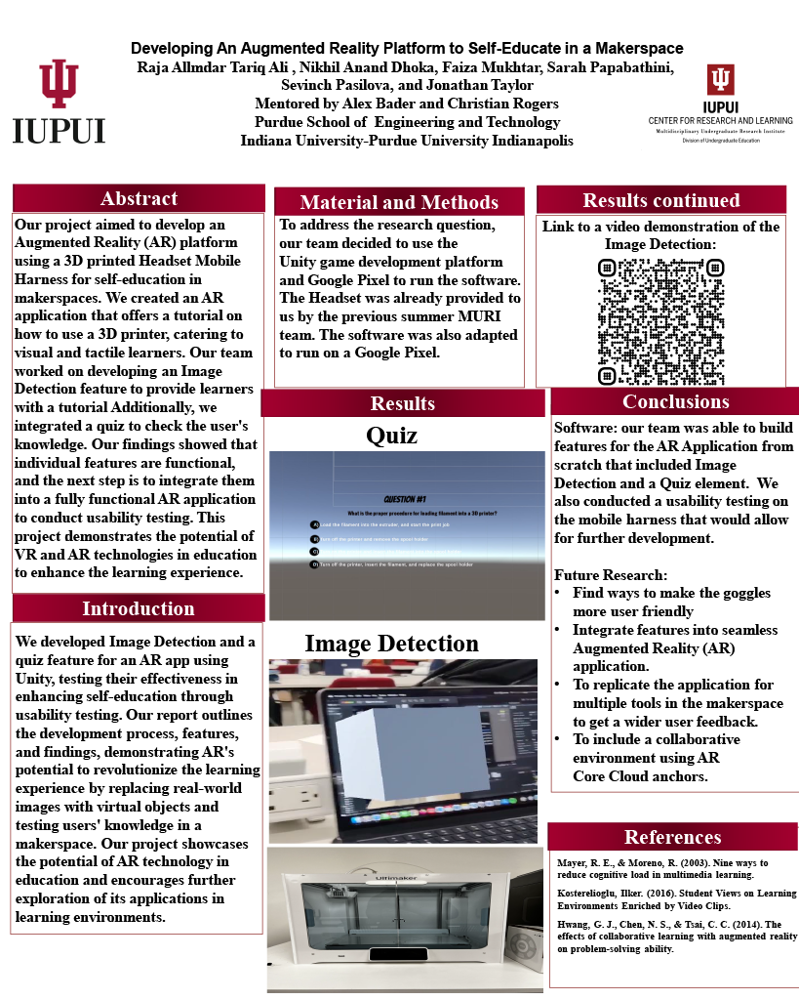

# MURI Augmented Reality Research Project with Machyne Makerspace (2022-2023)

## Table of Contents
1. [Introduction](#introduction)
2. [Requirements](#requirements)
3. [Project Description and Details](#project-description-and-details)
4. [Video Demonstration of Quiz Aspect](#video-demonstration-of-quiz-aspect)
5. [Video Demonstration of Image Detection Aspect](#video-demonstration-of-image-detection-aspect)
6. [Poster Presentation](#poster-presentation)

 
 

## Introduction

As part of a multidisciplinary team, including Nikhil Anand Dhoka, Faiza Mukhtar, Sarah Papabathini, Sevinch Pasilova, and Jonathan Taylor, we undertook an Augmented Reality Research Project in collaboration with the Machyne Makerspace in Indianapolis, Indiana, USA. Our participation was facilitated through the Multidisciplinary Undergraduate Research Institute (MURI). The team was split into two sub-teams, focusing on Hardware and Software aspects of the project. My contribution was primarily within the Software team. The project duration was from October 2022 to April 2023.

## Requirements

Ensure the following software and packages are installed:

- Unity 2021.3.11f1 or later
- AR Foundation 4.2.8 or later
- ARCore XR Plugin (for Android)
- ARKit XR Plugin (for iOS)

## Project Description and Details 

Under the guidance of Dr. Christian Rogers and Alex Badar, we developed an innovative Augmented Reality platform to assist learners at the 16 Tech Machyne makerspace in understanding and using complex machinery.

Here are the key aspects of the project and our contributions:

- **Comprehensive Research:** We began with an extensive study of various AR platforms, evaluating their strengths and limitations. This allowed us to make informed decisions about the platform best suited to our project. Our focus was also on the usability of existing AR platforms in educational settings, a factor which greatly influenced our design decisions.

- **Unity3D and AR Foundation:** Our project was developed using Unity3D and the AR Foundation package, enabling us to build the AR application for both Android and iOS devices, leveraging ARCore and ARKit respectively.

- **Implementation of Quiz and Image Detection Features:** The software team was responsible for implementing the quiz and image detection functionalities of the AR application. The Unity UI system was used to create the quiz feature, while the image detection was enabled by the AR Foundation package.

- **User Interface Development:** We created an AR-responsive user interface, featuring text, buttons, and panels. These elements were projected in the AR space via the AR Camera, fine-tuned for an optimal user experience.

- **Application Testing:** Extensive testing of the application was conducted on Android and iOS devices to ensure consistent performance across platforms. This involved addressing common build errors and managing app signing.

- **Logic Implementation:** Using C# scripts in Unity, we implemented the logic for the Quiz application and Image detection. This included the display of questions, verification of answers, scoring mechanisms, and procedures for ending the quiz.

## Video Demonstration of Quiz Aspect 

## Video Demonstration of Image Detection Aspect

## Poster Presentation 

This was my first time working on an AR project, and I had a lot of fun working on it. I learned a lot about AR, and I hope to work on more AR projects in the future. The previous MURI team also worked on this project and made significant progress, but the source code wasn't available to us and was lost in the process. So, we had to start from scratch. I hope that the next MURI team will be able to build on top of our work and make even more progress on this project. 
